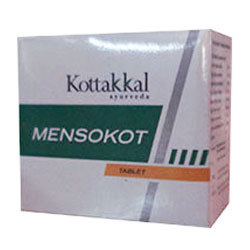

# Mensokot Tablet

For irregular cycles, painful periods, etc.

## Each Mensokot Tablet is prepared out of
* Asoka (Saraca indica) - 1.33g
* Sigru (Moringa oleifera) - 1.33g
* Kumari (Aloe barbadensis) - 1.33g
* Sunti ( Zingiber officinale) - 0.44g
* Maricha (Piper nigrum) - 0.44g
* Pippali (Piper longum) - 0.44g
* Tila (Sesamum indicum) - 1.33g
* Punarnava (Boerhaavia diffusa) - 1.33g
* Excipients q.s
