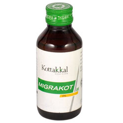

# Migrakot Oil

Migrakot Oil enhances the transmission of the nerve cells and reduces the chances of getting headaches.

## Each 10ml of Migrakot Oil is prepared out of
* Bala (Sida rhombifolia ssp.retusa) - 2.0g
* Hatha (Phyllanthus emblica) - 2.0g
* Amrita (Tinospora cordifolia) - 2.0g
* Mudga (Vigna radiata) - 2.0g
* Masha (Vigna mungo) - 2.0g
* Chandana (Santalum album) - 0.555g
* Yashti (Glycyrrhiza glabra) - 0.555g
* Rasna (Alpinia galanga) - 0.555g
* Tilataila (Sesamum indicum) - 5.0ml
* Liquid Paraffin Light - 5.8ml
* Perfume q.s
