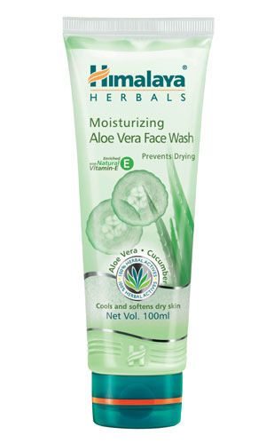

# Moisturizing Aloe Vera Face Wash

**Moisturizing Aloe Vera Face** Wash is a soap-free formulation that replenishes lost moisture from your skin after every wash, eradicating dry and stretched skin. It is enriched with Cucumber which cools and soothes while Aloe Vera tones and softens your skin. Our Moisturizing Aloe Vera Face Wash combines natural ingredients to cleanse your skin, leaving it feeling fresh and glowing.
Key ingredients:

    Cucumber makes an excellent toner as it immediately tightens open pores. The abundant antioxidants in Cucumber rejuvenate the skin and leave it feeling soft and smooth.

    Aloe Vera, known for its many healing properties, is rich in enzymes, polysaccharides and nutrients which exhibit antibacterial and antifungal action. Its hydrating, softening and intense moisturizing properties nourish the skin.

## Directions for use:
Moisten face, apply a small quantity of Moisturizing Aloe Vera Face Wash and gently work up a lather using a circular motion. Wash off and pat dry. Use twice daily.

Suitable for dry skin.
