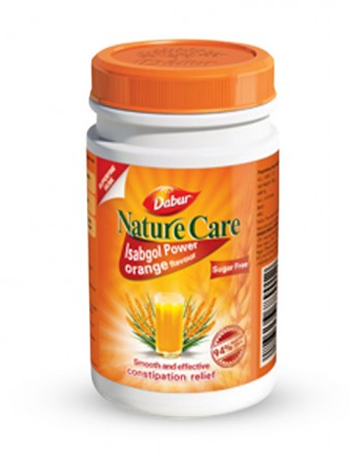

# Nature Care Isabgol Powder

Nature Care Isabgol Powder is a powdered Pysillium-based natural laxative for relief from constipation. It is a specially formulated, triple refined Isabgol. It is sweetened with sucralose, adding sweet taste to otherwise tasteless Isabgol, but is low in calories and diabetic friendly. It is natural and safe and has a tangy orange taste for better taste! Each spoon of 5gms provides approximately 15% of average daily fibre.

Indications:
Constipation, irritable bowel syndrome, reduces cholesterol naturally on prolonged usage.
