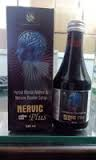

# Nervic Plus Syrup

Brain and nervous system problems are common. These neurological disorders include multiple sclerosis, Alzheimer’s disease, Parkinson’s disease, epilepsy, and stroke. Many can affect one’s memory and ability to perform daily activities. In considering all these problems they make nervic plus in syrup, capsule and in tablet form. It is natural and has no side effects.

## SYRUP COMPOSITION
Each 10ml syrup contains:-

* Brahmi(Bacopa monnieri) -                               200mg
* Aswagandha(Withania somnifera) -                  200mg
* Gotu kola(Centella asiatica) -                            150mg
* Tagar(Valeriana wallichii) -                               100mg
* Shilajit(Asphaltum punjabinum) -                     100mg
* Amla(Emblica officinalis) -                                             100mg
* Chamomile(Matricaria chamomilla) -                         100mg
* Jatamansi(Nardostachys jatamansi) -                          50mg
* Vach(Acorus calamus) -                                                  50mg
