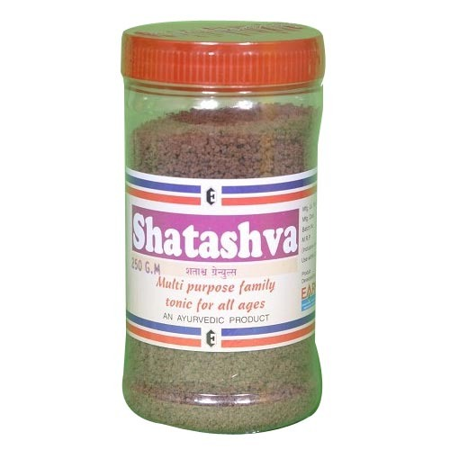

# Nutritional Tonic

[TOC]

Shatashva Granules is useful in following cases :

* For Treatment of Acidity: Hyper acidity and its consequence, Shatashva Granules should be taken two times with milk
* All A Rich Noursing And Delicious General Tonic For All Ages: Shatashva is recommended as general tonic where Patient complaint about general debility, weakness, weak digestive function, loss of appetite, tireness and especially for under weight
* A Protective Tonic And Rejuvenator For Women: Anemia caused by manorrhajia or excess menses, backache, nutritional anemia and other female complains, shatashva 1 tea spoon with milk three times a day should be given
* In Absence, Deficiency For Irregularity of Lactation: Shatashva has a powerful lactogenic and galactopoietic actions

## Composition: (each 100 gm)
* Satavari- As paragus Racamous 66.8%
* Ashwgandha-wihania somnifera- 20.0%
* Mandur-feroso revie oxide - 1.7%
* Prawalpisti-corallium rubrum- 1.7%
* Ilaichi-cardamom

## External Links
* [Shatashva Granules](http://www.indiamart.com/ethichemlaboratories/nutritional-tonic.html)
