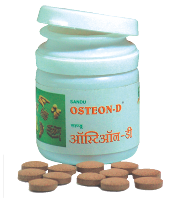

# OSTEON - D

[TOC]

The multifactorial natural calcium supplement

## Medicinal  Uses
Menopausal osteoporosis
Senile osteoporosis
Pregnancy and lactation
Growth phase of children
Elderly people
Healing of fractures

## Mode of action
OSTEON - D provides rich source of natural calcium and zinc.  OSTEON - D  improves liver function and thus helps for conversion  of Vit-D3 in to active principle for better calcium absorption and helps in deposition of calcium into bone matrix. It gives better results in osteoporosis.

## Benefits
Contributes to tissue regeneration and formation of bone
Natural calcium and zinc in easily assimilable form.
Increases bones strength
Fulfils increased nutritional demands in pregnant and lactating mothers

## Ingredients
Shouktik Bhasma,  Shankha Bhasma,  Dashmool,  Laghumalini Vasant, Guduchi (Tinospora cordifolia), Suwarna makshik

## Dose
Adults - 1 tablet  twice a day
Children- ½ tablet twice a day
