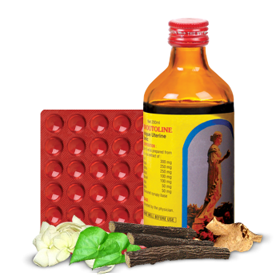

# Ovoutoline

[TOC]

The perfect uterine tonic. Indication: Dysmenorrhea, Menorrhagia, Irregular menstruation, Excessive vaginal discharge, Post menopausal symptoms. **Ovoutoline** is Useful for all types of Menstrual problems.

## Composition
Ovoutoline Liquid: Yashtimadhu (Glycyrrhiza glabra) 300 mg, Ashoka (Saraca indica) 250 mg, Lodhra (Symplocos racemosa) 250 mg, Guduchi (Tinospora cordifolia) 100 mg, Shatavari (Asparagus racemosus) 100 mg, Tagar (Valeriana walchii) 50 mg, Kurchi (Holarrhena antidysenterica) 50 mg.

Ovoutoline Tablet: Yashtimadhu(Glycyrrhiza glabra) 300 mg, Ashoka (Saraca indica) 300 mg, Lodhra (Symplocos racemosa) 300 mg, Guduchi (Tinospora cordifolia) 100 mg, Shatavari(Asparagus racemosus) 100 mg, Tagar (Valeriana walchii) 50 mg, Kurchi(Holarrhena antidysenterica) 50 mg.

## Dosage
Liquid: 1-2 teaspoonful thrice a day. Tablets: 1-2 tablets thrice a day. *Treatment is recommended for at least 3 menstrual cycles.
Ovoutoline by virtue of its marked anti-oxytocic, anti-inflammatory and anti spasmodic action corrects gynecological disorders. Reduces severity of uterine contractions & prevents excessive menstrual loss. Ideal for the treatment of excessive vaginal discharge of varied etiology. Valeriana walchii provides mild tranquilizing action which ameliorates various menopausal symptoms.

## List of Ayurvedic herb in which used in this preparation
[Holarrhena pubescens](Holarrhena_pubescens.md)

## References

## References

1. "Karnataka Medicinal Plants Volume - 3" by Dr.M. R. Gurudeva, Page No.346, Published by Divyachandra Prakashana, #45, Paapannana Tota, 1st Main road, Basaveshwara Nagara, Bengaluru.
