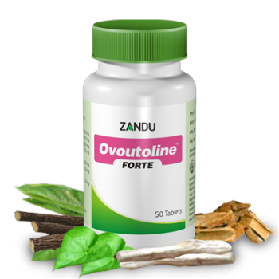

# Ovoutoline Forte

[TOC]

Zandu introduces extract based Forte Range of products in attractive HDPE container; herbs in extract form (100% soluble fraction) ensures better bioavailability; confirms the superiority & potency of Forte formulation with just 1 tab BD dosage. Its indication are as follows: Dysmenorrhoea, Irregular menstruation, Dysfunctional uterine bleeding (DUB), Pre-menopausal symptoms (PMS).

## Compsition
Lodhra (Symplocos racemosa) extract- 150 mg, Ashoka (Saraca indica) extract-100 mg, Shatavari (asparagus racemosus) extract-100 mg, Yashtimadhu (Glycyrrhiza glabra) extract-50 mg , Tagar (Valeriana wallichii)extract-50 mg, Guduchi (Tinospora cordifolia) extract-25 mg, Swet jiraka (Cuminum cyminum) 25 mg, Sunthi (Zingiber officinale) extract-25 mg.

## Dosage
 1 tablet twice daily or as directed by the physician. Treatment is recommended for at least 3 menstrual cycles.

* Extract based formula ensures better efficacy, potency & better disease control.
Better patient compliance with just 1 tab BD dosage compare to 2 tablet BD or TID conventional dosage
Derived from natural source, no side effects or adverse effects reported.
