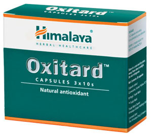

# Oxitard

Oxidative stress can lead to coronary artery disease, dermatosis and diabetes  mellitus amongst other ailments. Due to its potent antioxidant properties, Oxitard prevents photodamage and oxidation-related tissue damage.

**Gastroprotective:** Oxitard’s gastroprotective property protects the body from mucosal damage, which ensures optimum gastrointestinal health.

**Immunomodulatory:** The drug strengthens immunity and enhances the body’s ability to fight infections.

## Key ingredients
**Mango** (Amra) acts as a gastroprotective against gastric injury, due to its antisecretory and antioxidant properties. Amra is also a potent immunomodulator, which builds up the body’s resistance to infections. Chemical components present in mango pulp render the fruit its antioxidant property.

**Indian Gooseberry** (Amalaki) is highly nutritious and is an important dietary source of vitamin C, minerals and amino acids. The unique tannins and flavonoids of Amalaki have the ability to stimulate our natural antioxidant enzyme system. As a rejuvenative herb, Indian Gooseberry nourishes body tissues and accelerates the cell regeneration process. With its powerful nourishing qualities, it helps maintain energy levels and natural vitality. It nourishes the skin and improves skin health. As a powerful antioxidant, it helps scavenge free radicals. Free radicals are unstable oxygen-based ions in the body that have been linked to premature aging. It helps in building the body’s immune system and provides resistance against many diseases, especially those of the respiratory tract. Indian Gooseberry helps to maintain the health and optimal functioning of the liver and protects the liver from cellular damage. Amalaki is an excellent gastroprotective and soothes stomach ailments like hyperacidity.
