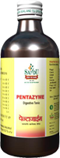

# PENTAZYME

[TOC]

A Digestive Enzyme Stimulator

## Medicinal  Uses
Loss of appetite
Indigestion
Anorexia
Flatulence, abdominal colic
Constipation

## Mode of action
Pentazyme normalises salivary, gastric, billiary, pancreatic and intestinal secretions and thus restores digestive power. It also improves appetite.

## Benefits
Stimulates appetite
Improves digestion
Restores health

## Ingredients
Pippali  (Piper longum), Miri ( Piper nigrum), Sunthi  (Zinziber officinale),  Chavya (Piper retrofractum),  Chitrak (Plumbago zeylanica),  Bhumyamalaki (Phyllanthus niruri), Erand patra (Ricinus communis) and 8 more herbs

## Dose
Children- ½ - 1 tsp twice a day
Adults - 1 tablespoon twice a day
