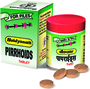

# PIRRHOIDS TEBLETS

[TOC]

## Importance
Pirrhoids tablet is effective in pile/ haemorrhoids with or without bleeding. It is ayurvedic treatment of Piles causes due to indigestion, Constipation. It relieves inflammation, helps in shrinkage of piles. Ensures smooth evacuation of bowel. Minimise aggravation of Haemorrhoids. Stops burning and itching due to piles.

## Dosage
1-2 twice in a day or as directed by physician.

## Indications
1. Haemorrhoids with or without bleeding
1. Piles
1. Indigestion
1. Constipation
1. Shrink of piles
1. Dysentery
1. Inflammation
1. Anorectic Pain
1. Heal anal fissures
