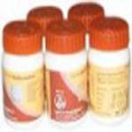

# Package Of Medicine 1 Month Dosage For Acidy And Hyperacidity

[TOC]

Package of medicine for acidy and hyperacidity is a combination of ayurvedic herbs recommended for gastrointestinal problems. It is a wonderful blend of natural traditional ayurvedic herbs that help in the acidity treatment. It consists of natural herbs that balances the pH of stomach and helps to relieve acidity. The natural remedies in this package are believed to reduce the formation of acid in the stomach and helps in the hyperacidity treatment. It helps in complete digestion of the food and helps to prevent gas formation. These remedies also help in other digestive ailments such as constipation, diarrhea, indigestion, etc. This package of several hyperacidity remedies help to cure acidity from its root cause. There are many acidity remedies in the market but this package of remedies is made to cure acidity. Some individual do not know how to cure acid stomach but this package o remedies is a great solution to get rid of acidity.

## Benefits of Package of medicines for acidy and hyperacidity
1. This package of different natural herbs helps in acidity treatment. It balances the pH of the stomach and helps in digestion of the food properly.
1. Different herbs present in this package help to maintain the acid base balance in the body.
1. These natural remedies activate the action of gastrointestinal enzymes for proper digestion of the food.
1. This package of medicine helps to increase appetite and also helps in proper digestion of food.
1. This package of natural remedies is also beneficial in the constipation and other digestive disorders. It helps in removal of toxic substances from the blood and helps in detoxification of the body.
1. Natural herbs in this package stimulate the functioning of liver and other digestive organs for proper metabolism of the food.
1. These remedies prevent formation of acids by stimulating the action of enzymes for complete digestion of the food.
1. Therapeutic uses
1. This package of medicines is a wonderful combination of natural herbal remedies for digestive disorders. These herbs help to cure acidity and hyperacidity without producing any side effects. These remedies give quick relief from heart burn and sooth the lining of the gastrointestinal tract and provide quick relief from acidity.
1. These remedies also help in the treatment of piles and constipation. It boosts up the energy and cleanses the body from toxic chemicals.

## How long to take it?
1. This package is made up of natural herbs that help in the acidity treatment. It is a wonderful combination of natural remedies that helps in the treatment of digestive disorders. These herbs may be taken every day for normal functioning of the digestive system. Therefore, a person may take this package of remedies for a longer period of time to get relief from digestive disturbances. These remedies may be taken regularly as it does not produce any side effects for prolonged period.
