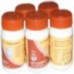

# Packages for Medicines for Arthritis / Joint Pain

This package of medicines for arthritis consists of natural and herbal remedies for arthritis. It is a wonderful and unique combination of herbs that are useful for arthritis natural cure. People suffering from arthritis may take this package of medicines for arthritis. It is a blend of traditional herbs that are found to be effective for relieving joint pains. Arthritis is the inflammation of joints in which joints become stiff and painful. There is redness and swelling of the affected joints. There is restriction to the movement of the affected joints and person is unable to perform the daily living activities. A package for Medicines for Arthritis is a combination of joint pain natural remedies. This combination helps in the treatment of joint pains and diseases of the joints in a natural way. It gives nourishment to the joints and muscles for optimum functioning. This package is safe and effective and does not produced undesired results. Anyone suffering from weakness of joints may take this package to strengthen the power of joints. Package of medicines for arthritis is an herbal combination of traditional herbs to relieve joint pain. The joint pain natural remedies give nutrition in the form of herbal supplements to the joints and increase their strength.

## Benefits of Package of medicines for Arthritis/Joint pain
1. This package consists of natural arthritis pain treatment remedies. The herbs provide nourishment to the joints and help in optimum functioning.
1. The herbal remedies in this package work for normal functioning of the joints so that affected people may perform their daily activities.
1. The herbs are believed to support easy movement of the body parts as it increases the strength of the muscles and joints.
1. People in old age who suffer from joint problems should take this package of natural remedies to increase the strength of their joints and perform their activities normally.
1. This package of remedies works very well for inflammatory diseases of the joints as it quickly relieves signs of inflammation and pain by giving nutritional support to the joints.
1. This package of remedies provides strength to the muscles and ligaments so that pain is reduced naturally.
1. This package of remedies is also indicated to boost up the energy so that joints may get enough support to work normally.
