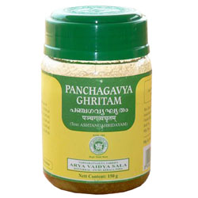

# Panchagavya Ghritam

[TOC]

Panchagavya Ghrita is an Ayurvedic medicine, in herbal ghee form. This medicine has ghee as its base. It is used for preparatory procedure for Panchakarma and also as medicine. Panchagavyam refers to five different components of cow products.

## Benefits of Kottakkal Ayurveda Panchagavya Ghritam
* Arrests aging process
* Activates the immune system, increases human body resistance to diseases
* Removes the consequences of stress, depression, and chronic fatigue syndrome.
* Makes blood, liver, intestines, pancreas get rid of toxins.
* Improves the functioning of the gastrointestinal tract.
* Normalizes the endocrine system.
* Normalizes blood pressure, strengthens the heart muscle.
* Inhibits the growth of tumor cells.
* Improves sexual function; it is recommended for impotence and frigidity.
* Helps brain function better, enhances memory, and improves learning ability.
* Neutralizes the side effects of chemotherapy.
* Normalizes the body's metabolic processes, contributes to weight correction.
* Provides effective protection against adverse factors caused by the pollution and poisoning of the environment, including radiation effects.

## Composition of Kottakkal Ayurveda Panchagavya Ghritam
Ghritam10.549ml, Gomay asvarasam10.549ml, Gomutram10.549ml, Gadhi10.549ml, Ksiram 10.549ml.
