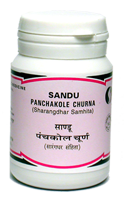

# Panchakola Churna

[TOC]

1. It is an excellent appetizer and digestive medicines
1. It is specially useful in flatulence, anorexia, and indigestion.

## Indications
1. Anorexia
1. flatulence
1. splenomegaly
1. caugh and asthma

## Dose
1/2 to 1 tab 2 times

## Ingredients
1. Piper longum
1. Piper retdofractum
1. Plumbago
1. zeylanic
1. zingiber officinali
