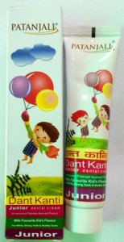

# Patanjali Dant Kanti Junior Dental Cream

**Patanjali Junior Dental cream** is wonderful baby toothpaste. It contains herbal remedies that provide proper minerals to the teeth of children. It helps in proper cleaning of teeth. It is wonderful kids toothpaste that gives a good taste. It helps to give baby tooth care and promotes natural development of teeth in your child. Patanjali Junior Dental cream is a blend of natural herbs that increases the strength of teeth. It gives shining and white teeth to your child. It also helps to protect your child’s teeth from decay and inflammation. Children usually eat candies that cause tooth decay. It helps to clean teeth properly and prevents teeth decay in children. It supplies essential minerals such as calcium and phosphorus to the teeth in children for proper growth and development. Many children complain of tooth pain due to inflammation of gums. Regular use of kids toothpaste helps to prevent tooth decay and gives relief from pain. It is a unique baby tooth paste that helps in the proper formation of teeth and your child may get shining white teeth by using this toothpaste every day.

## Benefits of Patanjali Junior Dental cream
1. Patanjali junior Dental cream is especially made for baby tooth care. It contains natural herbs that prevent tooth decay and cavities and children.
1. It is a wonderful baby tooth paste that helps in proper cleaning of teeth in children. They can use this toothpaste regularly to get neat and clean teeth.
1. Children will love the taste of kids toothpaste because it is made up of natural herbs that provide essential minerals for the proper growth of teeth.
1. It provides natural baby tooth care and helps to prevent recurrent pain and inflammation of teeth in children.
1. It also helps to prevent cavities in children by restricting the growth of harmful bacteria. Many children do not brush or wash their mouth after eating candies that may give rise to the growth of bacteria. Brushing teeth with this toothpaste will prevent the growth of bacteria and gives relief from pain and inflammation.
1. It is wonderful kids toothpaste that is absolutely safe for kids. It may be used by children of all ages. It supplies proper minerals such as fluorine, calcium and phosphorus to the teeth for building strong teeth in children.
