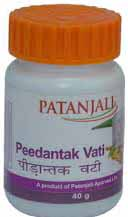

# Patanjali Peedantak Vati

[TOC]

Arthritis is a disease that affects the joints. Mostly it occurs after the middle age. There is pain and swelling in the joints. Mostly bigger joints are involved. In arthritis, there is inflammation of the joints. There is severe pain in the joints. There is no treatment in conventional medicine. Arthritis natural remedies help to provide great relief. Natural remedies for joint pains are very useful. Herbs for joint pain help to boost up the immunity and decrease the pain naturally by supplying necessary nutrients to the tissues and cartilage of the joints. Arthritis mostly occurs in people with weak immunity. It is an autoimmune disorder. One should take precautions to avoid severe pain and swelling of the joints. Arthritis limits the movement of the people. They are not able to move due to painful joints. They cannot take conventional remedies for a long time because conventional remedies produce many side effects. Therefore, it is necessary to take herbs for joint pain. Herbs help to nourish the joints naturally and prevent inflammation of the joints.

## Arthritis symptoms
1. Pain and swelling are the most common symptoms of arthritis. It becomes difficult to walk and perform daily activities.
1. There is inflammation and stiffness of the joints. Patient may feel pain on slightest movement or touch.
1. Fever is present due to inflammation of the joints. Patient feels weak and tired and there is no desire to do any work.
1. People suffering from arthritis may become restless and do not want to sit at one place. They are not able to move frequently due to pain in the joints.
1. Joints become red and in chronic cases patient may have pain while sitting also.
1. There is tenderness in the joints and there is reduced movement of the joints.

## Benefits of Patanjali Peedantak vati
1. It helps to boost up the immune system. The herbs found in this natural remedy provide nourishment to the joints and help to strengthen the tendons and ligaments.
1. It gives quick relief from swelling and inflammation of the joints.
1. It reduces pain and stiffness of the joints.
1. It helps to increase the movement of the joints.
1. It is an excellent joint pain remedy that makes your joints strong.
1. It is also a wonderful herbal remedy for gout and other joint problems
