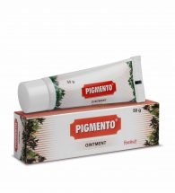

# Pigmento Ointment

**A natural therapy for vitiligo**
PIGMENTO is a comprehensive therapy in vitiligo. Immunological attack on the melanocytes and free radical damage are considered to be the cause of vitiligo. Psoralea corylifolia the main ingredient of PIGMENTO stimulates melanocytes to synthesize melanin, the pigmenting agent. Acorus calamus, Cassia tora and Melia azadirachta have antifungal properties. Tephrosia purpurea modulates both the cell-mediated and the humoral components of the immune system.    Other ingredients also have immuno-modulating and antioxidant properties. Thus, PIGMENTO effectively induces repigmentation in vitiligo.
