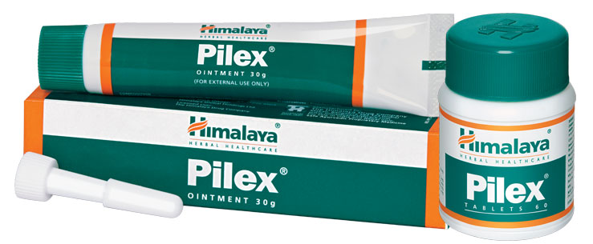

# Pilex

**Pilex** shrinks pile mass, controls bleeding and heals inflamed skin and the mucus membrane. The drug offers symptomatic relief from rectal bleeding, pain, itchiness and corrects chronic constipation associated with hemorrhoids.

**Relieves pain:** The local analgesic property of Pilex relieves pain and ensures pain-free fecal excretion.

**Antimicrobial:** As an antimicrobial, it prevents secondary microbial infections in the body.

## Key ingredients
**Sensitive plant** (Lajjalu) has astringent and styptic properties that are beneficial in treating bleeding piles.

**Zinc calx** (Yashad bhasma) accelerates wound healing by epithelial (surface tissue) regeneration.
