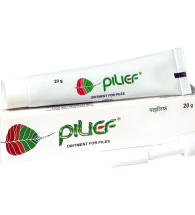

# Pilief Ointment

**A topical formulation to treat & prevent piles**

**PILIEF** Ointment is an effective topical treatment for piles. **Haridra** (Curcuma longa) and **Neem** (Melia azadirachta) in PILIEF ointment exhibit potent antiseptic and antiinflammatory properties. **Khadira** (Acacia arabica) is potent astringent that helps control bleeding, **Yastimadhu** (Glycyrrhiza glabra) and **Kumari** (Aloe barbadensis) are soothing and possess healing property. Thus, PILIEF ointment helps to reduce burning sensation, itching and pain due to piles (haemorrhoids).
