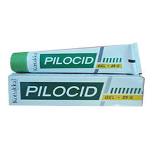

# Pilocid Gel

[TOC]

Arrests the bleeding and can be used effectively in managing bleeding piles.

## Indications for use of Pilocid Gel
Hemorrhoids.

## Each 5g Pilocid Gel is prepared out of
* Vishamushti (Ageratum conyzoides) - 2.0g
* Lajjalu (Mimosa pudica) - 2.0g
* Palandu (Allium Cepa) - 2.0g
* Yashti (Glycyrrhiza glabra) - 0.187g
* Keratailam (Cocos nucifera) - 1.350g
* Gel base q.s
* Perfume q.s
