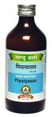

# Pippalysava

[TOC]

It is good appetizer and digestant. It pacifies vitiated kapha and vata dosha
It provides strengthens liver. It is useful in coeliac disease and lactose intolerance,
and sprue. It improves appetite and correct gastro-intestinal tract function in Intestinal tuberculosis

## Indication
1. Anorexia
1. Indigestion
1. Irritable
1. Bowel syndrome
1. caugh
1. Asthma
1. Tubaculoris.

## Dose
4 tab 2 times

## Ingredients
Piper longum, Piper nigrum, Piper retropractim, Curcuma longa, Plumbago zeylanica, Cyperus, rotundus, Embelia ribes, symplocos racemosa, Areca catechee, Cissampelos pareira, embelica officinalis, Aloe vera, Santalum alba, syzygium, aromaticm, valeriana walichi, Nardostachys Jatamansim Cinnamomum zeylanicum, Elettaria cardamomum, Cinnamomum tamala, Mesua perrae, Vitis vinifera etc.
