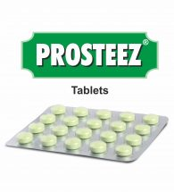

# Prosteez Tablet

Benign prostatic hyperplasia (BPH) is a noncancerous enlargement of the prostate gland that can make urination difficult. **Prosteez** is a herbo-mineral formulation that alleviates the symptoms of BPH, urinary tract infections, painful urination and incomplete feeling of urination. Soya (Glycine soja) in Prosteez provides the isoflavone genistein, which is known to have an inhibitory effect on the enzymes responsible for the growth of prostatic tissue and offers antioxidant effect. Saw palmetto (Serenoa repens) and Varun (Crataeva nurvala) arrest the proliferation of the prostate cells. Kanchanar (Bauhinia variegata) is known to have antiinflammatory activity. Thus, Prosteez eases the urine flow and is a complete support for BPH.
