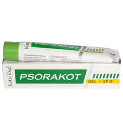

# Psorakot Gel

[TOC]

Psorakot Gel is a preparation for topical application based on the oil preparation Ayyappalakeratailam trusted by the phsicians in the treatment of Psoriasis. The ingredient composition of Wrightia tinctoria and Neem in Coconut oil base helps the preparation to fight against Psoriasis as an anti bacterial, antiseptic and astringent. Application in conjunction with Psorakot tablet helps in the effective management of Psoriasis.

## Indications for use of Psorakot Gel
Psoriasis and Skin Disorders.

## Each 5g Psorakot Gel is prepared out of
* Svetakutaja (Wrightia tinctoria) - 6.0g
* Nimba (Azadirachta indica) - 0.374g
* Keratailam (Cocos nucifera) - 1.5g
* Gel base q.s
* Perfume q.s
