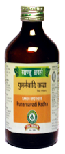

# Punarnavadi Kadha

[TOC]

**Effective diuretic and anti-inflammatory action**
1. Has immune modulator action
1. Reduce inflammation of urinary system
1. It stimulates nephrons by increasing blood supply to kidneys
1. Useful in Oliguria
1. Diuretic action
1. Eliminates excretes excess of salt & water and reduces oedema

## Indication
Generalized oedema, Oliguria, Anemia, Jaundice & Hepatitis.

## Dose
4 tsf 2 times

## Ingrdients
Boerhaavia diffusa, Aconitum heterophyllum, Embelia ribes, Cissampelos pareria, Holarrhena antidysenterica etc.
