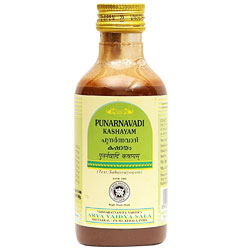

# Punarnavadi Kashayam

[TOC]

* It is used in the treatment of inflammatory conditions like myxedema, ascites.
* A natural diuretic.
* It is also used in the treatment of respiratory conditions, cold, cough, anemia and abdominal pain

## Usage of Kottakkal Ayurveda Punarnavadi Kashayam
5 to 15 ml mixed with three times of boiled and cooled water or as directed by the physician.

## Ingredients of Punarnavadi Kashayam
* Punarnava
* Nimba
* Patola
* Sunthi
* Tikta
* Amrita
* Darvi
* Abhaya
