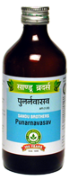

# Punarnavasav

[TOC]

**Effective in Liver disease associated with Ascites Hepato-protective and Diuretic**

1. It is useful in liver disorders associated with generalized oedema with Ascites.
1. It has diuretic, anti-inflammatory, hepatoprotective and cholagogue action.
1. By its diuretic action it excretes excess fluid out of body thus helpful in Generalised oedema and Ascites.
1. It protects liver cells as well as it helps in regeneration of Liver cells
1. By its cholagogue action it ensures proper bile flow into the intestine

## Indications
1. Hepatitis
1. Cirrhosis of Liver
1. Ascites and Generalised oedema and Oliguria.

## Dose
4 tsf 2 times.

## Ingredients
* Boerhavia diffusa, Tribulus terrestris, Solanum indicum, Solanum surattense, Terminalia chebula, Terminalia bellerica, Embelica officinalis, Piper longum, Piper nigrum, Zingiber officinale, Berberis aristata, Adhatoda vasica, Ricinus communis, Picrorrhiza kurroa, Azadirachta indica, Tinospora cordifolia, Raphanus sativus, Fagonia cretica, Trichosanthes dioica, Woodfordia fruticosa, Vitis vinifera, Sugar, Honey.
