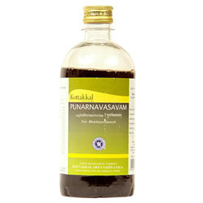

# Punarnavasavam

[TOC]

Punarnavasava is widely used as herbal anti inflammatory and anti oedema medicine. it reduces swelling, useful in liver and spleen conditions, and fever.

## Indications for use of Kottakkal Ayurveda Punarnavasavam
It helps to treat Swelling in body, Disorders of Abdomen & Spllen, Acid gastritis, Liver disorders, Abdominal Lump, Fever.

## Ingredients of Kottakkal Ayurveda Punarnavasavam
* Trikatu
* Triphla
* Darvi
* Savadamshtra
* Brihatidwaya
* Erandmula
* Vasa
* Katuki
* Gajpippali
* Sophagni
* Pichumarda
* Guduchi
* Sushkamuka
* Patola
* Dhataki
* Draksha
* Makshika
* Sita
