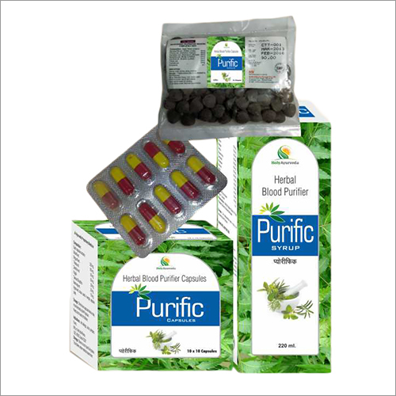

# Purific Syurp

The Purific has been specially formulated with natural herbs that have been proven over centuries to heal skin problems such as acne, allergy, skin infection, boils, and promote a healthy, clear complexion from the inside by purifying the blood.

## SYRUP COMPOSITION
Each 10 ml contains:

* Kalmegh(Andrographis peniculata) -                      150mg
* Tulsi(Ocimum sanctum) -                                       150mg
* Brahmi(Centella asiatica) -                                     150mg
* Madder(Rubia cordifolia) -                                   100mg
* Senna(Cassia angustifolia) -                                  100mg
* Revand chini(Rheum emodi) -                              100mg
* Daruhaldi(Berberis aristata) -                               100mg
* Afsanteen(Artemisia absinthium) -                       100mg
* Kachoor(Curcuma zedoaria) -                               50mg
* Amla(Emblica officinalis) -                                         50mg
* Giloy(Tinospora cordifolia) -                               50mg
* Chirata(Swertia chirata) -                                     50mg
* Pitpapda (Fumaria officinalis) -                                   50mg
* Neem(Azadirachta indica) -                                40mg
