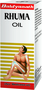

# RHEUMA OIL

[TOC]

## Importance
Primarily used for joint pains. it is also useful in Pain in flanks, Rheumatoid Arthritis, Osteo-Arthritis, Neuralgias, Nervine weakness, Gout, Mastitis, Cholinergic Symptoms related to Vata, Traumatic pain etc.

## Dosage
Apply twice or three times in a day on affected part of body.

## Indications
1. Joint pain
1. Arthritis
1. Nervine Weakness
1. Rheumatoid
1. Neuralgias
