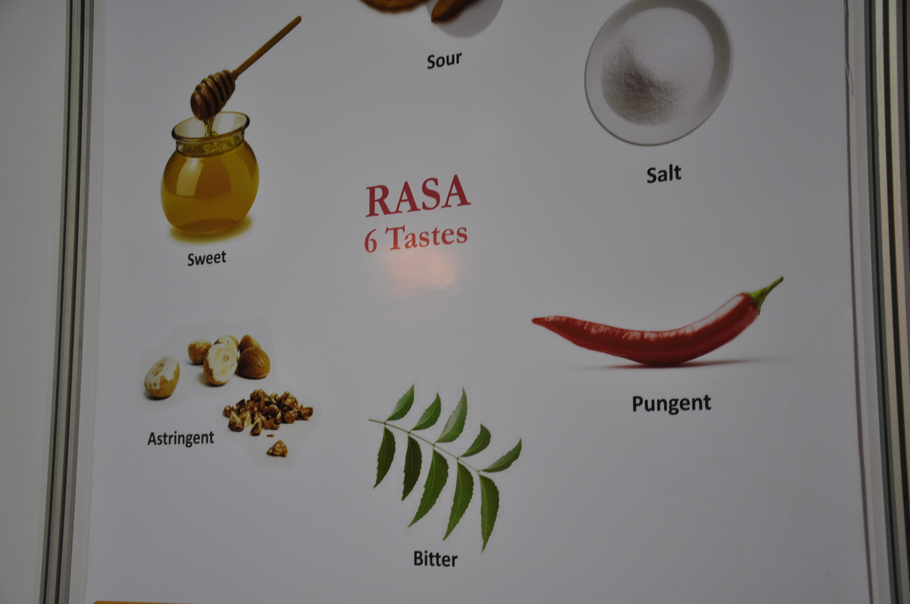

# Rasa

Usually we do not connect taste with therapeutic property. Ayurveda states that the taste of an herb is not incidental, but is an indication of its properties. Different tastes possess different properties. The Sanskrit word for taste, rasa, has many meanings. All of them help us to understand the importance of  taste in Ayurveda. Rasa means ‘essence’. Taste thus indicates the essence of a plant and so is perhaps the prime factor in understanding its qualities. Rasa means ‘sap’, so that the taste of an herb reflects the properties of the herb which invigorates it. Rasa according to context, means liquid, potion, nectar, essence, semen.

Sap, aesthetic appreciation, artistic delight, melodious sound, the element of mercury or the other minerals used with it in alchemy, the expressed juice of fruit, leaves or other plant parts, an extract of meat (usually its soup), and emotion. In sum, Rasa represents every juice that makes life possible and worth living.

The science of herbal energetics of Ayurveda recognises six main rasas (tastes);

*Sweet* (madhura), *sour* (amla), *salty* (lawana), *pungent* (katu) *bitter* (tikta) and *astringent* (kasaya). These are derived fro the five elements or panchamahabhutas.
