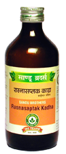

# Rasnasaptak Kadha

[TOC]

1. Useful in musculo-skeletal pain.
1. EAnti-inflammatory and analgesic
1. It is used in new cases of musculo-skeletal disorder.
1. Useful in rheumatoid arthritis
1. Relieves back pain, low back pain, Sciatica

## Indications
Lower-back pain, Backache, Pain in thighs, pain in ribs, Rheumatoid arthritis, Osteoarthritis.

## Dose
2 to 8 teaspoonful 2 times

## Ingredients
Vanda roxburghi, Ricinus communis, Tribulus terrestris, Cedrus deodar, Boerharria diffusa, Tinospora cordifolia, Cassia fistula
