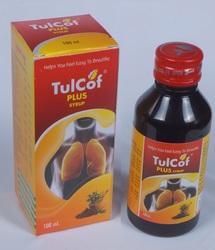

# Respiratory Products

* **TULCOF-PLUS Syrup**:- Tulcof-Plus Syrup helps in the treatment of Cough, Cold, and Asthma.

* **Respirid Syrup**:- Respirid Syrup helps in Asthmatic Cough, Whooping or dry Cough, Smokers Recurring Cough and many more.

* **Tulcof Syrup**:- Tulcof Syrup helps in Cough, Cold , Congestion, Acute and chronic bronchitis, allergic cough, Laryngitis and Pharyngitis.

* **Panesia Rubefacient**:- Panesia Rubefacient helps to Exerts exothermic action on pains & colds, joint pains chest-affection and congestions.

* **Herbal Anti Asthmatic Respirid Capsule**:- Herbal Anti Asthmatic Respirid Capsule helps in treating Asthmatic cough, whooping or dry cough, smokers recurring cough, chest congestion, cough due to tuberculosis.

* **Respirid Tablets**

* ** Tulcof Capsules**

## External Links
[Trio Healthcare Pvt. Ltd.](http://www.triohealthcare.net/respiratory-products-range.html)
