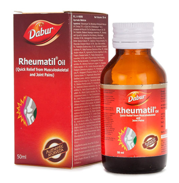

# Rheumatil Oil

Rheumatil Oil is an Ayurvedic oil with herbal extracts, which provides relief from joint and musculoskeletal pains. It has anti-inflammatory, quick absorption, rapid action and counter irritant properties, which reduces joint pain, swelling and stiffness.

## Key Ingredients
* Gandhapura oil
* Guggulu
* Pudina
* Neelgiri oil
