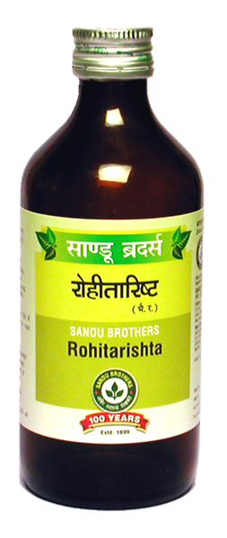

# Rohitakarishta

[TOC]

## Effective in Spenomegaly
It is useful in spleen and Liver disorders. It has blood purifier and digestive action.
It regulates secretion of digestive enzyme and corrects indigestion. It is useful in complications of hepatomegaly and splenomegaly i.e. general debility, anorexia, indigestion, bloating of abdomen etc.

## Ingredients
1. Tacoma undulata
1. Woodfordia fruticosa
1. Piper longum
1. Piper chaba
1. Plumbago zeylanica
1. ingiber officinale
1. Cinnamomum zeylanicum
1. Elettaria cardamomum
1. Cinnamomum tamala
1. Terminalia chebula
1. erminalia bellerica
1. Embelica officinalis

## Indications
1. Jaundice
1. Hepatitis
1. Splenomegaly
1. Generalised oedema
1. Ascites
1. Heart disease
1. Irritable Bowel Syndrome.

## Dose
4 tsf 2 times.
