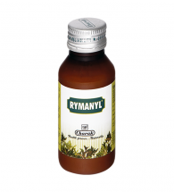

# Rymanyl Liniment

**The topical liniment to reduce pain & inflammation**

RYMAYNL liniment is a topical composition for reducing joint pain and swelling. Kapur (Camphora officinarum) exerts counter-irritant activity thereby, relieving pain instantly. Erand (Ricinus communis), Deodar (Cedrus deodara), Ashwaganda (Withania somnifera) and Nirgundi (Vitex negundo) reduce inflammation and pain to improve joint mobility.
