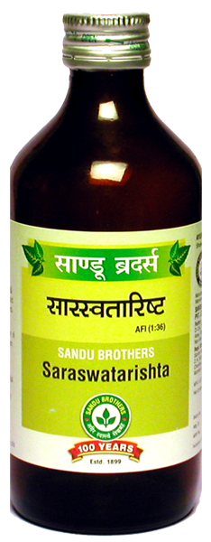

# Sarasawatarishta

[TOC]

It provides longevity, strength, Acquisition, Cognity and Recollection power. It is useful for all age groups. It provides strength to heart muscles as well as improves blood supply to heart muscles. It is helpful in condition of memory loss due to any cause. It is an nervine tonic and has special effect on Central nervous system.

It is indicated in conditions of Delayed Menarch, Dysmenorrhoea and Premenstrual Syndrome. It is indicated in Dementia, Hysteria, Epilepsy and other Psychological disorders.

## List of Ayurvedic herb in which used in this preparation
[Asparagus racemosus](Asparagus_racemosus.md), [Centella asiatica](Centella_asiatica.md), [Pueraria tuberose](Pueraria_tuberose.md), [Terminalia chebula](Terminalia_chebula.md), [Foeniculum vulgare](Foeniculum_vulgare.md), [Zingiber officinale](../herbs/Zingiber_officinale.md), [Woodfordia fruticosa](Woodfordia_fruticosa.md), [Vitex negundo](../herbs/Vitex_negundo.md)

## Dose
4 tsf 2 times/Day

## References

## References

1. "Karnataka Medicinal Plants Volume - 3" by Dr.M. R. Gurudeva, Page No.1199, Published by Divyachandra Prakashana, #45, Paapannana Tota, 1st Main road, Basaveshwara Nagara, Bengaluru.
