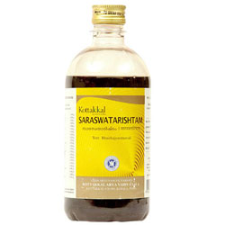

# Saraswatarishtam

[TOC]

This Ayurvedic formula is for memory power. it enhances the brains ability to absorb information and hence has been popular with students for a long time. It also helps those who suffer from epilepsy and insomnia.

## Indications for use of Kottakkal Ayurveda Saraswatarishtam
It helps to boost memory, improves learning abilities, alleviates fatigue, relieves physical and mental stress, corrects functional disorders of vocal cord.

## Each 10ml prepared out of
* Brahmi 1.944g
* Satavari 0.486g
* Vidarika 0.486g
* Abhaya 0.486g
* Usira 0.486g
* Ardraka 0.486g
* Misi 0.486g
* Renuka 0.024g
* Trivrita 0.024g
* Kana 0.024g
* Devapushpa 0.024g
* Vacha 0.024g
* Kushtha 0.024g
* Vajigandha 0.024g
* Vibhitaki 0.024g
* Amrita 0.024g
* Ela 0.024g
* Vidanga 0.024g
* Twak 0.024g
* Swarnapatra 0.002g
* Dhataki 0.486g
* Sita 2.500g
* Makshita 0.972g
