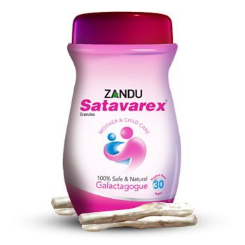

# Satavarex

[TOC]

The Xtra edge galactogogue. Indication: To improve inadequate lactation. For regular and longer lactation. In pregnancy, Satavarex nourishes the mother as well as the foetus. As a nutritional supplement.

## Composition
Satavarex contains- Shatavari (Asparagus racemosus 20% in the form of granules.

## Dosage
1-2 tablespoonful twice a day mixed with milk.

* An effective galactogogue which stimulates the natural process of lactation, allows smooth flow of milk and promotes breast feeding. Helps boost prolactin levels (as it exerts anti-oxytocic effects due to release of phyto-estrogens). Nourishes the mother as well as the foetus. Nutritional tonic.
