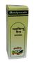

# Shadbindu Taila

[TOC]

**Shadbindu Taila** is Useful for Headaches

## List of Ayurvedic herb in which used in this preparation
[Zingiber officinale](../herbs/Zingiber_officinale.md), [Ricinus communis](Ricinus_communis.md)

## Importance
It is used for Nasya Ayurvedic treatment. It is useful in Ayurvedic treatment of headache, dizziness, migraine.

## Dosage
2-6 drops of the oil are instilled into each nostril, after massage and hot treatment to face.

## References

## References

1. "Karnataka Medicinal Plants Volume - 2" by Dr.M. R. Gurudeva, Page No.675, Published by Divyachandra Prakashana, #45, Paapannana Tota, 1st Main road, Basaveshwara Nagara, Bengaluru.
