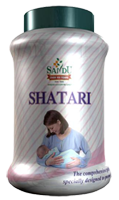

# Shatari (Granules)

[TOC]

There is no substitute for mother’s milk and keeping this truth in mind SHATARI Granules are formulated to meet the nutritional demand of both mother and the child. Shatari is specially suited to conditions where there is an inadequacy of breast milk in nursing mothers. It has clinically proven galacogogue property.

## Uses
1. Promotes lactation
1. Acts as a nutritive tonic
1. Nourishes the baby.

## Dose
2 teaspoonful twice a day with milk.

## Ingredients
Asparagus recemosus
