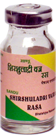

# Shirshuladri

[TOC]

1. It is especially useful in headache due to muscular spasm in the muscles of head and neck.
1. The main active ingredient of this formulation is purified Commiphora mukul, which in combination with Dashmool & other ingredients that exhibits strong analgesic action to reduce pain & spasm of muscles.
1. Sandu Shirashooladivajra ras possess anti-inflammatory action, thus useful in headache due to sinusitis by reducing inflammation of mucous membrane of nose and nasal sinuses.

## Indications
1. Migraine headaches
1. stress headaches
1. Headache due to Sinusitis

## Dose
1 tab 2-3 times

## Ingredients
Shuddha Parad, Shuddha Gandhak, Tamrabhasma, Commiphora mukul, Terminalia chebula, Terminalia bellerica, Glycyrrhiza glabra, Dashmool (Aegle marmelos, Gmelina arborea, Oroxylum indicum, Clerodendrum phlomidis, Stereospermum chelonoides, Desmodium gangeticum, Uraria picta, Solanum indicum, Solanum surattense and Tribulus terrestris.)
