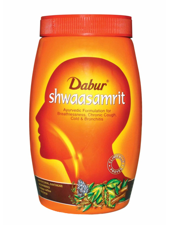

# Shwaasamrit

Breathe easy with **Dabur Shawaasamrit**. Packed with the goodness of  powerful herbal ingredients it help combat multiple problems related to the respiratory system. Its potent formulation  eliminates the cause  from the grassroots level and helps build immunity against diseases like breathlessness, chronic cough, cold, bronchitis and allergies.

Why Dabur Shwaasamrit?

* Increases airflow to lungs
* Works as an expectorant to help reduce cough
* Strengthens the respiratory system
* Reduce breathlessness
* Helps treat asthma & bronchitis
