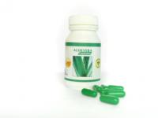

# Single Herb Capsules (Dietary Food Supplements)

1. **Amla Capsules**:- Amala capsules have pure extract of Amla juice which is best known to stop graying of hairs before age, baldness, & all kind of hair problems as well.

2. **Aswagandha Capsules**:- Aswagandha capsules designed to  works in suppressing pains of any sort. Ashwagandha root has been regarded as the 'ginseng' of Ayurvedic medicine. It is the most commonly used herbal supplement that helps to improve physical energy, athletic ability and increase sexual capacity.

3. **Cissus Capsules**:- Cissus quadrangularis capsules is used for obesity, diabetes, a cluster of heart disease risk factors called “metabolic syndrome,” and high cholesterol

4. **Fenugreek Capsules**:- Fenugreek  capsules are used for digestive problems such as loss of appetite, upset stomach, constipation, and inflammation of the stomach (gastritis).

5. **Papaya Leaf Extract Capsules**:- Papaya leaf extract capsules aids in flushing and removing toxins from your blood stream. Herbal Papaya has formulated this unique supplement to not just remove but also aids to rebuild and strengthen the veins and arteries that transport blood throughout the body.

6. **Moringa Capsules**:- Moringa capsules are made using the pure Moringa Leaf Powder. Moringa leaf powder is nutrient rich And a vitamin supplement.

7. **Boswellia (Shallaki) Capsules**:- Shallaki capsules is a proven, effective 100% safe and natural herbal remedy, which will act as a natural anti-inflammatory agent and provides relief to the joints and muscle tissues that are stiff and painful. Shallaki also helps treating joint and muscular conditions like osteoarthritis, fibrositis, rheumatism, small joint disease and lower back pain.

8.:- **Wheatgrass Capsules**:- Wheatgrass Capsules helps in Improve the digestive system, Prevent cancer, diabetes and heart disease,Cure constipation and many other uses.

9.:- **Aloe Vera Capsules**:- Aloe Vera Capsules helps in Halts the growth of cancer tumors, Lowers high cholesterol, Repairs "sludge blood" and reverses "sticky blood", Boosts the oxygenation of your blood, Eases inflammation and soothes arthritis pain and many other uses.

10. **Bacopa Capsules**:- Bacopa Capsules helps in Not just brain relevant treatments it can also be used in skin treatments or also in culinary usages.

11. **Curcumin Capsules**

12. **Garcinia Capsules**:- Garcinia cambogia is one of the hottest weight loss product.

13. **Gymnema Capsules**

14. **Noni Capsules**:- Noni Capsules acts to boost your immune system and used for many other reasons also.

15. **Spirulina Capsules**

## External Links
* [Single Herb Capsules (Dietary Food Supplements)](http://www.tvsbiotech.net/herbal-medicines.htm)
