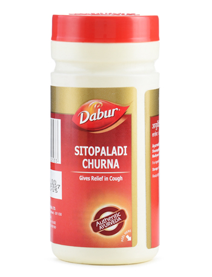

# Sitopaladi Churna

**Sitopaladi Churna** is a traditional Ayurvedic formulation for treatment of cough and cold. It is made from herbs like Pippali, which is one of the best expectorants available in nature.
It gets absorbed into the body and provides nutrition and energy to digest the mucous conditions.

## Health Benefits
Treats cough and cold conditions.
