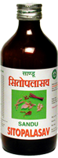

# Sitopalasav

[TOC]

Sitopalasav helps in better absorption and assimilation of nutrients from food.
It stimulates secretion of digestive enzymes into the G.I. tract and improves appetite and digestion. It provides nutrition to the tissues of central nervous system. Therefore, it is considered to be an excellent tonic for the brain. It reduces excess body heat by its refrigerant (cooling) action. It has demulcent, expectorant and tonic action and therefore it is used in cough and other respiratory disorders.

## Indications
1. Post febrile debility
1. Cough
1. General debility
1. Mental Fatigue.

## Dose
2-4 teaspoonful twice a day.

## Ingredients
* Vitis vinifera, Nelumbo nucifera, Piper longum, Embelica officinalis, Asparagus adscendens, Eugenia caryophyllata, Cinnamomum camphora, Eletteria cardamomum, Cinnamomum zeylanicum, Mesua ferrea, Myristica fragrance, Vetiveria zizanioidis, Zingiber officinale, Carum bulbocastanum, Aquilaria agallocha, Nardostachys jatamansi, Piper longum, Santalum album, Valeriana wallichi, Piper cubeba, Acorus calamus, Bamboo manna, Woodfordia fruticosa.
