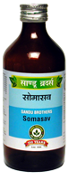

# Somasav

[TOC]

**Effective in Asthma and bronchitis**

It has broncho-dilator effect. It is especially useful in cough, cold and bronchial asthma which develop due to cold. Cold exposure can result into cough, cold and breathlessness due to excessive mucous secretion into the respiratory tract. It reduces excessive mucous secretion and provides much desired relief to the patients.

## Indications
1. Bronchial Asthma
1. Cough & Common cold.

## Dose
2-4 tsf 2 times

## Ingredients
1. Ephedra gardiana
1. Adhatoda vasica
1. Clerodendrum serratum
1. Glycyrrhiza glabra
1. Madhuca
1. indica
1. Zingiber officinale
1. Woodfordia
1. fruticosa etc.
