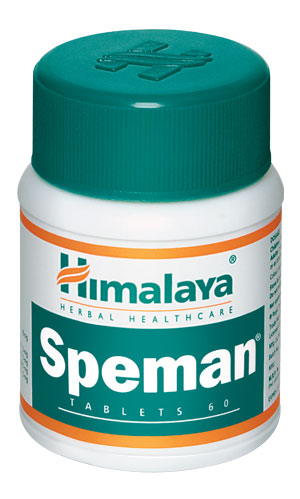

# Speman

The natural ingredients in Speman promote spermatogenesis (the process of sperm formation) by improving testosterone levels in men affected by oligospermia (semen with low concentration of sperm). It further improves the sperm count and the quality of semen by increasing the LH-FSH producing basophil cells in the pituitary.

The drug improves sexual desire and sustains penile erection. It also contains herbs that have effective aphrodisiac properties, which is helpful in seminal weakness.

## Key ingredients
**Hygrophilia** (Kokilaksha) is beneficial in treating impotence, spermatorrhea and seminal debilities.

**Cowhage/Velvet Bean** (Kapikachchu) is an aphrodisiac, which supports the production of hormones associated with the ‘pleasure system’ of the brain. The herb is a prophylactic (preventative) against oligospermia (low sperm count).

**Small Caltrops** (Gokshura) contains protodioscin (a steroidal saponin compound) which converts to dehydroepiandrosterone (DHEA) in the body, a precursor of testosterone, which improves sexual desire and sustains penile erection.
