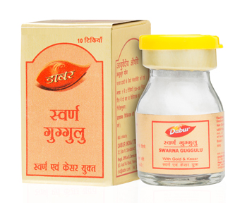

# Swarna Guggulu Gold

Dabur Swarna Guggulu Gold is an Ayurvedic remedy which is useful in treating all types of ‘Vatarog’, which include ailments such as Arthritis, Joint Pains, Paralysis, Sciatica, and other physical & mental weakness etc. It contains Gold and Kesar among other ingredients, which have rejuvenating properties.

## Key Ingredients
* Swarna Bhasma
* Ashvagandha
* Kumkuma
